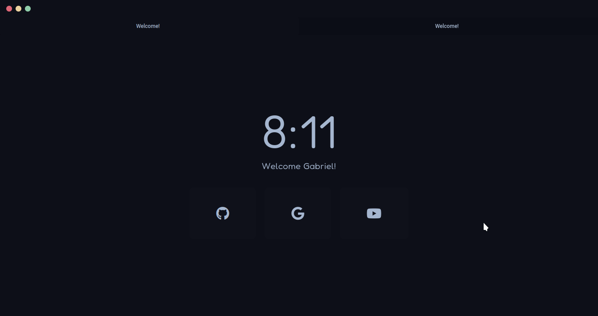

# Decay for firefox (userchrome)

Custom userchrome for firefox using decay as colorscheme!

## Installation

1. In the searchbar type about:config. A dialog will be shown to you. Press the I accept the risk button.
2. Search for `toolkit.legacyUserProfileCustomizations.stylesheets`, `layers.acceleration.force-enabled`, `gfx.webrender.all`, and `svg.context-properties.content.enabled`. Change them to `True`.
3. Go to your Firefox profile:
  - If you're on Linux: `$HOME/.mozilla/firefox/XXXXXXX.default-release/`
  - If you're on Windows: `C:\Users\<USERANME>\AppData\Roaming\Mozilla\Firefox\Profiles\XXXXXXX.default-XXXXXXX`
  - If you're on MacOS: `Users/<USERNAME>/Library/Application Support/Firefox/Profiles/XXXXXXX.default-XXXXXXX`
4. Move one folder inside `src` (the palette that you want) into the directory, and rename it to `chrome`.
5. Enjoy

## Usage

This userstyle was made for a keyboard centered usage. Use the following for a better experience:

- `Alt` You can access to the global menu for an extended options you need
- `Alt + Left Arrow` You can go Back
- `Alt + Right Arrow` You can go Forward
- `Ctrl + L` focuses the Navbar
- `Ctrl + B` shows you the Bookmarks 
- `Ctrl + H` shows you the History Bar
- `Ctrl + T` Opens a new Tab
- `Ctrl + W` Closes a Tab
- `Ctrl + Shift + T` Re-opens a tab that you just closed
- `Ctrl + R` Refresh the page you're on
- `Ctrl + Shift + A` Quick open for Add-Ons

## Thanks to

This userchrome is based on [janleigh's](https://github.com/janleigh) one. Thanks!

## Enjoy

If you liked this, please, remember to give us a star :>
